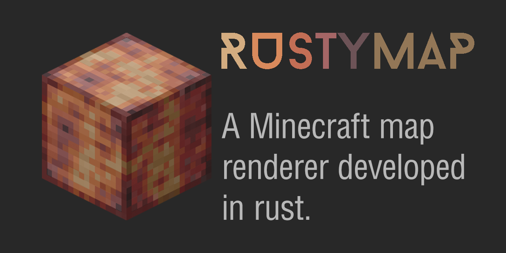

# rustymap
Render Minecraft Maps

## This is a learning project

This project is primarily a learning tool for me to learn [Rust](https://doc.rust-lang.org/book/). I mostly work with other languages, such as PHP, Python, and JavaScript, all of which were self-taught. I learn through immersion, and this project is an example of this. The following are my goals and how I intend to meet them:

### Learning goals

#### Proper Syntax
You can't have a working codebase if the syntax is wrong!

#### Variables, Types, and Data Structures
Minecraft NBT data provides ample opportunity to learn how to convert data between different types, parse data from raw bytes, and much more.

#### File Input/Output
This will be part of the process of reading data from the Minecraft files in raw format to parse as NBT data, as well as manipulating and saving image data back onto the filesystem.

## Roadmap / ToDo List
This is a list of things I have done/need to do which is updated as I think of things

### Configuration Parser
- [x] Decide on config structure
- [x] Create full valid config file
- [x] Implement default values for missing settings
- [ ] Validate defined render dimension
- [x] Add checks and exits for invalid inputs
- [ ] Verify/create given output directory

### Region Files
- [x] Go through header table to identify chunks
- [x] Decompress raw bytes to NBT bytes
- [x] Implement NBT parser for region chunks

### Chunks & Sections
- [x] Extract data version of chunk
- [x] Collect x, y, z coordinates
- [x] Compile block states pallet list
- [x] Calculate block and sky lighting values

### Named Binary Tags (NBT)
- [x] Identify each type of NBT format tag
- [x] Create ability to ingest each data type
- [x] Create an NBT struct of tags _(is this necessary?)_

### Textures
- [x] Check for valid default/given texture path
- [x] Add directory traversal methods for `.jar`/`.zip` archives
- [x] Create cache directory named by hash of texture container file
- ~~[ ] Add drill-down methods for extracting block textures on-demand~~
- [x] Extract all textures into cache directory
- [x] Create staging area for texture files _(aka cache)_

### Rendering
- [ ] Render overworld top-down
- [ ] Render nether top-down sans roof
- [ ] Render any isometric chunk section
- [ ] Render any isometric full chunk
- [ ] Figure out how to handle non-solid blocks _(fence, stairs, etc.)_
- [ ] Figure out how to ignore hidden blocks
- [ ] Add settings to adjust rotation

### Browser Viewer
- [ ] ????? _(obviously JavaScript is the defacto standard for these types of projects, but Rust can do [web assembly](https://www.rust-lang.org/what/wasm) so I guess I could dive into that?)_
